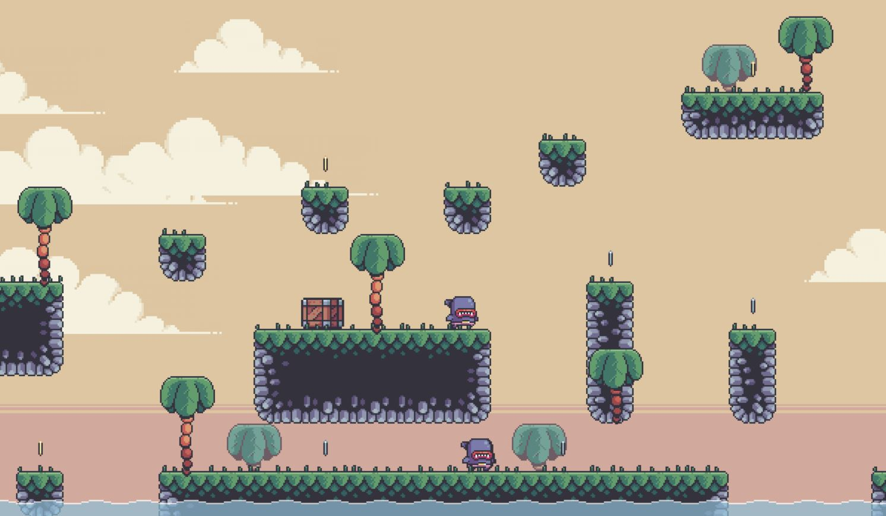

# Platformer
 Following along a tutorial from Clean Code (https://www.youtube.com/watch?v=wJMDh9QGRgs&t=8757s&ab_channel=ClearCode). It's a platformer inspired by the old Mario games. Doing the project to get experience in making tilemaps, importing them into pygame and how to slice the images - lots of fun stuff.
